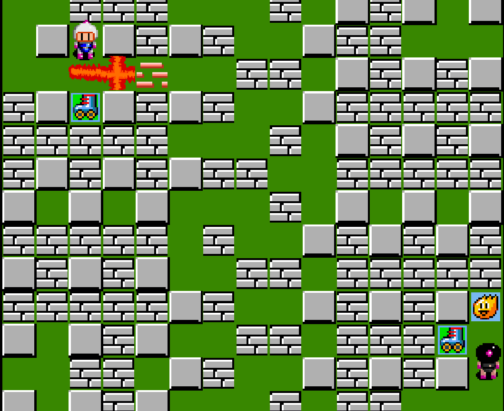
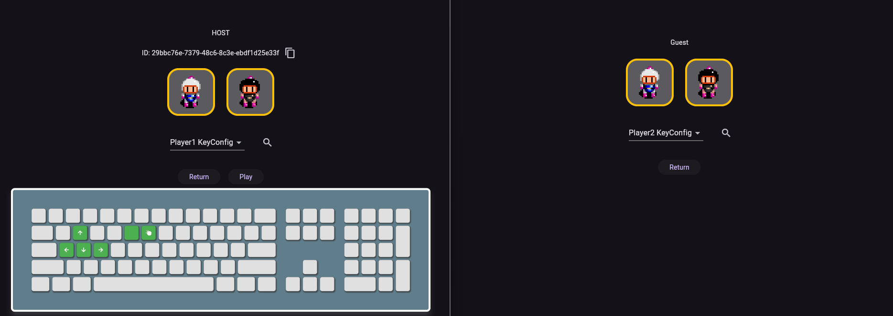
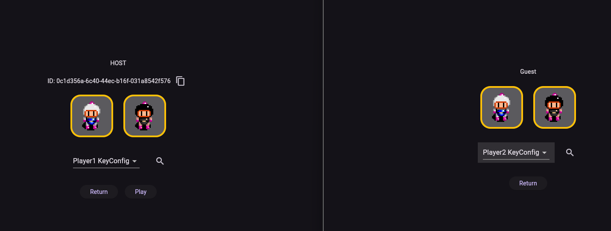
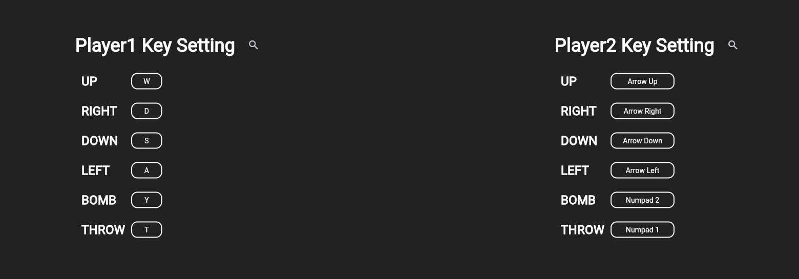
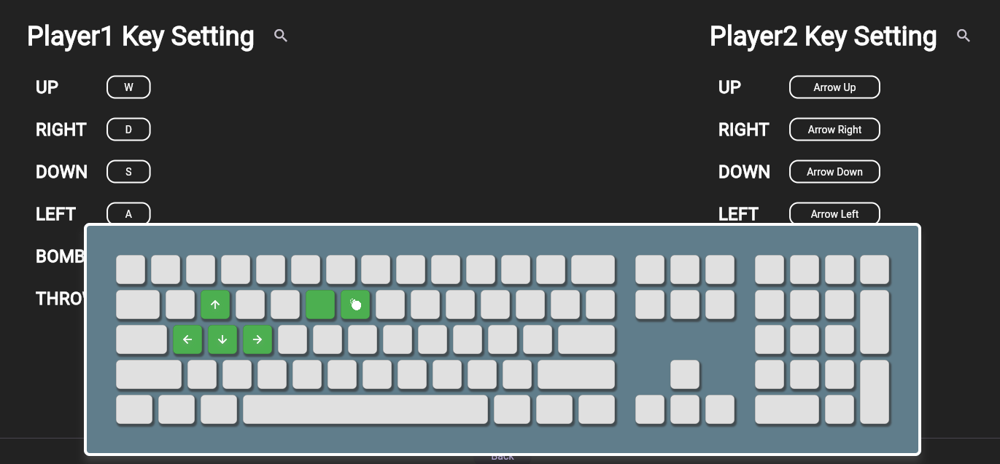

# Flutter BomberMan

## Live Demo

Check out the live demo of BomberMan: [Demo](https://flutterbomberman.web.app/)

## Project Overview

**Flutter BomberMan** is a Bomberman-style game implemented using **Flutter Bonfire**. It supports peer-to-peer (P2P) multiplayer connections, allowing two players to connect and play together seamlessly. The P2P functionality is powered by the **PeerDart** package. Additionally, players can customize the control bindings for both Player 1 (1P) and Player 2 (2P), and preview the key configurations with an intuitive preview screen.

### Key Features:

- **P2P Multiplayer**: Play with friends via P2P connection, providing a smooth and direct multiplayer experience using PeerDart.
  
- **Custom Key Bindings**: Players can customize their control keys for both Player 1 and Player 2, offering a personalized gaming experience.
  
- **Key Binding Preview**: Preview the custom key bindings for both players with a visual layout.  
  

## Abilities

In the game, players can pick up various abilities that enhance their gameplay. Below is a list of the available abilities with their respective effects:

### Ability Showcase:

<table>
  <tr>
    <td></td>
    <td><strong>Bomb Capacity</strong>: Picking up this ability allows the player to place more bombs on the map simultaneously.</td>
  </tr>
  <tr>
    <td></td>
    <td><strong>Explosion Power</strong>: Increases the explosion range in all four directions when the player places a bomb, making it more powerful.</td>
  </tr>
  <tr>
    <td></td>
    <td><strong>Speed Boost</strong>: Grants a temporary increase in the player's movement speed, allowing them to navigate the map faster.</td>
  </tr>
  <tr>
    <td></td>
    <td><strong>Kick Bomb</strong>: When this ability is obtained, the player can kick bombs upon contact, sending them across the map. (Currently not implemented in P2P mode).</td>
  </tr>
  <tr>
    <td></td>
    <td><strong>Throw Bomb</strong>: (Not yet implemented). This feature will allow players to throw bombs over walls for strategic advantage.</td>
  </tr>
</table>

Enjoy!